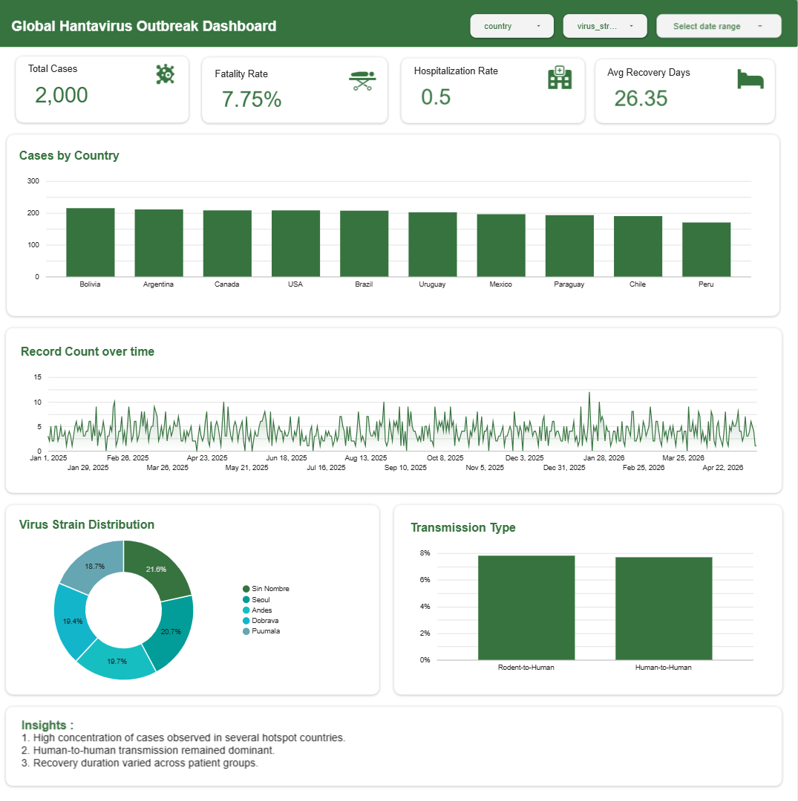

# 🌍 Global Hantavirus Surveillance Analysis

## 📌 Project Overview

This project analyzes global Hantavirus surveillance data to identify disease distribution, transmission patterns, patient demographics, hospitalization outcomes, recovery trends, and environmental factors associated with reported cases.

Using Exploratory Data Analysis (EDA) in Google Colab and an interactive dashboard in Google Looker Studio, this project generates data-driven insights that support disease surveillance, healthcare planning, and public health decision-making.

---

## 📂 Dataset

- **Dataset:** Global Hantavirus Surveillance Dataset
- **Source:** Kaggle
- **Records:** 2,000 reported Hantavirus cases
- **Features:**
  - Country
  - Report Date
  - Virus Strain
  - Transmission Type
  - Exposure Source
  - Patient Age
  - Gender
  - Hospitalization Status
  - Fatality Status
  - Recovery Days
  - Symptoms
  - Temperature
  - Humidity
  - Rainfall
  - Other environmental indicators

---

## 🛠️ Tools & Technologies

- Google Colab
- Python
- Pandas
- NumPy
- Matplotlib
- Seaborn
- Google Looker Studio
- Git & GitHub

---

## 📊 Dashboard Preview




The dashboard provides interactive insights into:

- Total Cases
- Hospitalization Rate
- Fatality Rate
- Cases by Country
- Virus Strain Distribution
- Transmission Type Analysis
- Exposure Source Analysis
- Patient Demographics
- Recovery Analysis
- Symptom Analysis
- Time Trend Analysis

---

## ❓ Business Questions

This project answers the following questions:

1. What is the overall overview of Hantavirus cases, hospitalization, and fatality rates?
2. Which countries reported the highest number of Hantavirus cases?
3. Which Hantavirus strains are most frequently reported?
4. What are the most common transmission types of Hantavirus?
5. What are the most common exposure sources associated with Hantavirus cases?
6. What are the demographic characteristics of Hantavirus patients?
7. Does hospitalization vary between male and female patients?
8. How does hospitalization differ across age groups?
9. How does the fatality rate vary across different Hantavirus strains?
10. How does recovery time differ among Hantavirus strains?
11. What are the most commonly reported symptoms among Hantavirus patients?
12. Are environmental factors associated with Hantavirus cases and recovery outcomes?
13. How have reported Hantavirus cases changed over time?

---

## 🔍 Key Findings

- Analyzed **2,000 reported Hantavirus cases** from the surveillance dataset.
- Approximately **50.35%** of patients required hospitalization, while the **fatality rate was 7.75%**.
- **Bolivia** reported the highest number of confirmed Hantavirus cases.
- **Sin Nombre** was the most frequently reported virus strain.
- Human-to-human transmission occurred slightly more often than rodent-to-human transmission.
- Cruise, warehouse, and rodent exposure were the most common reported exposure sources.
- Fever, fatigue, and headache were the most frequently reported symptoms.
- The average recovery period was approximately **26 days**, with only minor differences across virus strains.
- Environmental variables showed weak correlations with patient recovery outcomes.
- Reported cases fluctuated over time without a clear long-term increasing or decreasing trend.

---

## 💡 Business Recommendations

Based on the analysis, the following recommendations are proposed:

- Strengthen disease surveillance in countries reporting the highest number of cases.
- Increase public awareness regarding both rodent-related and human-to-human transmission.
- Promote early diagnosis by educating healthcare providers and the public about common Hantavirus symptoms.
- Ensure healthcare systems maintain sufficient capacity to manage hospitalization demand.
- Continue monitoring virus strains to support disease surveillance and outbreak preparedness.
- Implement preventive measures across multiple exposure settings, including residential, occupational, and travel-related environments.
- Integrate environmental monitoring with epidemiological surveillance to improve outbreak detection and public health response.

---

## 📁 Repository Structure

```text
Global-Hantavirus-Surveillance-Analysis/
│
├── dashboard/
│   ├── Hantavirus_Dashboard.pdf
│   └── looker_studio_link.txt
│
├── data/
│   ├── raw/
│   │   └── hantavirus.csv
│   └── processed/
│       └── hantavirus_clean.csv
│
├── notebook/
│   └── Hantavirus_Analysis.ipynb
│
├── images/
│   ├── dashboard-up.png
│   ├── cases_by_country.png
│   ├── virus_strain_distribution.png
│   ├── transmission_type.png
│   ├── hospitalization_analysis.png
│   ├── symptom_analysis.png
│   ├── correlation_heatmap.png
│   └── time_trend.png
│
├── README.md
├── requirements.txt
├── LICENSE
└── .gitignore
```

---

## 🚀 How to Run

1. Clone this repository.

```bash
git clone https://github.com/viviashilah/Global-Hantavirus-Surveillance-Analysis.git
```

2. Open the notebook using **Google Colab**.

3. Upload the dataset (if it is not included in the repository).

4. Run all notebook cells to reproduce the analysis.

5. Open the Google Looker Studio dashboard using the provided link in:

```text
dashboard/
└── looker_studio_link.txt
```

---

## 📈 Dashboard Features

The interactive dashboard includes:

- KPI Cards
- Cases by Country
- Virus Strain Distribution
- Transmission Type Analysis
- Exposure Source Analysis
- Patient Demographics
- Hospitalization Analysis
- Fatality Analysis
- Recovery Analysis
- Symptom Analysis
- Time Trend Analysis
- Interactive Filters by Country, Virus Strain, and Gender

---

## 👤 Author

**Zulfianti Rahmawati Ashilah**

- Aspiring Data Analyst
- GitHub: https://github.com/viviashilah
- LinkedIn: https://linkedin.com/in/zulfianti-ashilah

---

⭐ If you find this project useful, feel free to star this repository!